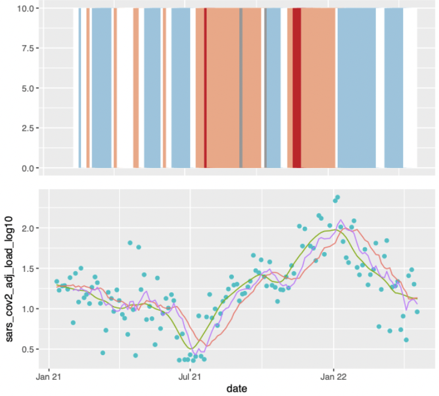

  

    
  

# AFIDSI Covid-19 Wastewater Analysis

This is a collection of analyses of Wisconsin covid-19 wastewater data using the R language along with a wastewater data analysis package that is available from the University of Wisconsin's Data Science Institute.
 
This project is a collaboration between the University of Wiscosin's Data Science Institute (DSI), the Wisconsin Department of Health Services (DHS), and the State Lab of Hygiene (SLH). 

DSI:
- <https://datascience.wisc.edu>

DHS:
- <https://www.dhs.wisconsin.gov>
- <https://www.dhs.wisconsin.gov/covid-19/wastewater.htm>

SLH:
- <http://www.slh.wisc.edu/environmental/covid-19-wastewater/>

## Sample results

- [Downsampling (Two Days)](results/downsampling/DownsamplingTwoDays.pdf)

  This analysis seeks to answer whether the DHS method is robust when reducing the number of measurements to two days per week.

  

    
  

- [Downsampling Interceptor (Two Days)](results/downsampling/DownsamplingInterceptor.pdf)

  This analysis seeks to answer whether the DHS method is robust when reducing the number of measurements to two days per week using data from the 5 interceptor points.

  

    
  

## Conclusions

The following documents contain findings and conclusions from the data analysis described above.

1. [Wastewater Data Downsampling](./docs/conclusions/downsampling/wastewater-data-downsampling.pdf)

2. [Wastewater Data Smoothing](./docs/conclusions/smoothing/wastewater-data-smoothing.pdf)

## Requirements

### 1. The R Language

The AFIDSI Covid Wastewater Analysis code is written in R so you will need an [R interpreter / environment](./docs/r/r-language.md) to run it. 

### 2. The AFIDSI Wastewater Package

The AFIDSI Covid Wastewater Analysis package is an R package that provides a collection of utilities to perform wastewater data analysis for pathogenic surveillance and monitoring.

## Installation

View our package readme to learn more about the installation process [DSIWastewater](https://github.com/AFIDSI/DSIWastewater/blob/main/README.md)

<!-- LICENSE -->
## License

Distributed under the Sustainable Use License. See `LICENSE.md` for more information.

<!-- TEAM -->
## Contact
Email:
- Marlin Lee - (mailto:mrlee6@wisc.edu)

- Abe Megahed - (mailto:amegahed@wisc.edu)

- Kyllan Wunder - (mailto:kwunder@wisc.edu)

Repos:
- Package Link: [https://github.com/AFIDSI/DSIWastewater](https://github.com/AFIDSI/DSIWastewater)

- Analysis Link: [https://github.com/AFIDSI/Covid19-Wastewater-Analysis](https://github.com/AFIDSI/Covid19-Wastewater-Analysis)
