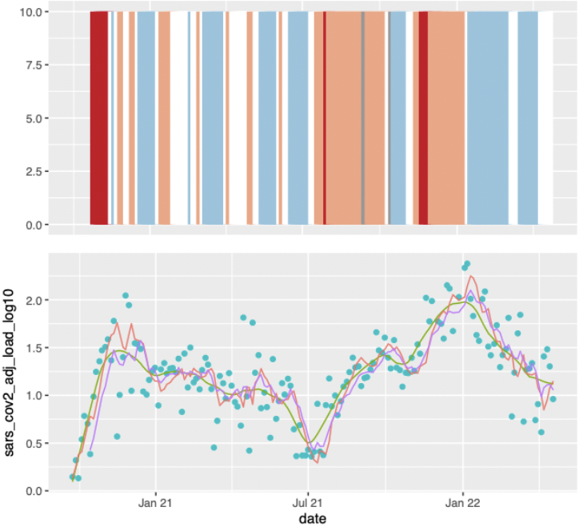

<p align="center">
  <div align="center">
    
  </div>
</p>

# AFIDSI Covid Wastewater Analysis (Development)
 
This is a collaborative project between the University of Wiscosin's Data Science Institute (DSI) and the Wisconsin Department of Health Services (DHS) to perform analysis on wastewater data for covid-19 surveillance and monitoring. 

DSI:
- <https://datascience.wisc.edu>

DHS:
- <https://www.dhs.wisconsin.gov>
- <https://www.dhs.wisconsin.gov/covid-19/wastewater.htm>
- <http://www.slh.wisc.edu/environmental/covid-19-wastewater/>

## Sample results

- [Downsampling (Two Days)](results/DownsamplingTwoDays.pdf)

<p align="center">
  <div align="center">
    
  </div>
</p>

- [Downsampling Interceptor (Two Days)](results/DownsamplingInterceptor.pdf)

<p align="center">
  <div align="center">
    
  </div>
</p>

## Requirements

### 1. The R Language

The AFIDSI Covid Wastewater Analysis code is written in R so you will need an [R interpreter / environment](./docs/r/r-language.md) to run it. 

### 2. The AFIDSI Wastewater Package

The AFIDSI Covid Wastewater Analysis package is an R package that provides the foundation for analysis of wastewater data. 

## Installation
There are two ways to install the AFIDSI Covid Wastewater Analysis package:

### 1. Using Devtools

Download the package using the R devtools command below
```
devtools::install_github(
    "AFIDSI/DSIWastewater",
    auth_token = "REPLACEWITHYOURAUTHTOKEN"
)
```
 
To get a AUTHTOKEN you need to go to https://github.com/settings/tokens and create one with at least [repo level access](./docs/github/repo-level-access.md).

### 2. Using a TAR (.tgz) file

1. Download the tar file

You can download the AFIDSI wastewater package tar file from the following location:
https://github.com/AFIDSI/DSIWastewater/blob/main/DSIWastewater_0.2.01.tar.gz

Note: When you download it, make sure that it remains zipped.  It should be a .tar.gz file rather than a .tar file.   If the file has been unzipped, then you can re-zip the file using the following command:

```
gzip DSIWastewater_0.2.01.tar
```

2. Install the tar file

To install the tar file, you can use the following command:

```
install.packages("DSIWastewater_0.2.01.tar.gz", repos = NULL, type="source") 
```

Alternatively, if you are using RStudio, you can install the tar file [using the user interface](./docs/r-studio/installing-packages.md).

## Viewing
 
- View the package vignettes with:

```
vignette(package = "DSIWastewater")
```

- Look at all package functionality with:

```
help(package = "DSIWastewater")
```
 
- Release notes are stored here:
 
https://docs.google.com/document/d/1-Rbd0YTyPZ2slbW9ksvF36n_nhhEBNi0vJZAmhwNHsg/edit

## Code style
 
- Camel case for functions and file names
 
- Snake case for variables
 
- _data for data objects

- _Plot if the function creates a plot


<!-- LICENSE -->
## License

Distributed under the Sustainable Use License. See `LICENSE.md` for more information.

<!-- TEAM -->
## The AFIDSI Covid Wastewater team includes:
Steve Goldstein, Marlin Lee, Kyllan Wunder, and Abe Megahed

<!-- CONTACT -->
## Contact

Steve Goldstein - (mailto:sgoldstein@wisc.edu) - email

Project Link: [https://github.com/AFIDSI/DSIWastewater](https://github.com/AFIDSI/DSIWastewater)
