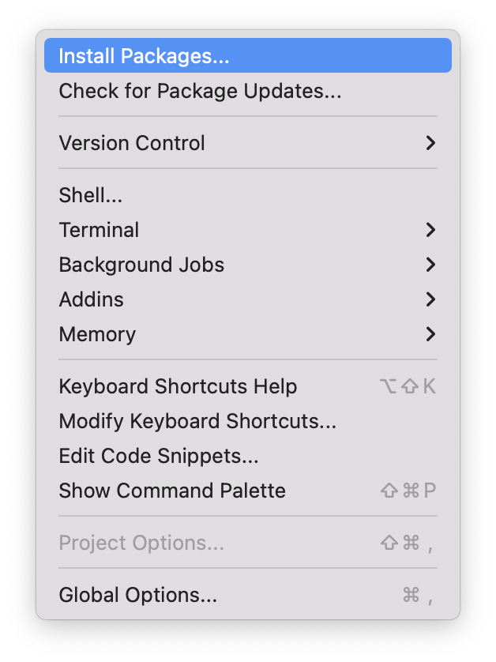
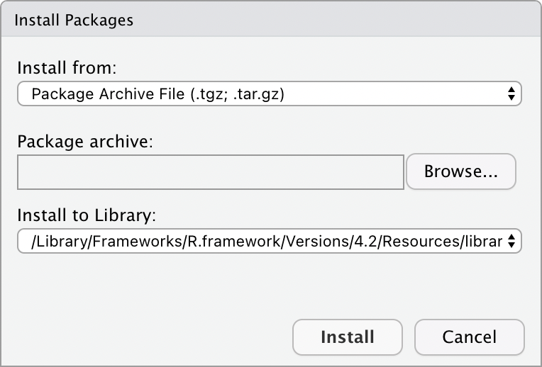

# Installing Packages Using R Studio

To install a package using R Studio, follow these steps:

- Step 1: Under the "Tools" menu, click "Install Packages":

<div align="center">

</div>

- Step 2: On the install package dialog, click "Browse" to select the tar file:

<div align="center">

</div>

- Step 3: Click the "Install" button:
  You should see the following command executed in the R Studio console pane:

```
install.packages("~/Downloads/DSIWastewater_0.2.01.tar.gz", repos = NULL, type = "source")
```

---
**Tip:**

If you see the following command followed by an error, then it is likely because the file that you are installing is not a '.tar.gz' file.   

```
install.packages("~/Downloads/DSIWastewater_0.2.01.tar", repos = NULL)
```

If the tar file has been unzipped, make sure to rezip it using the following command and repeat the installation process.

```
gzip ~/Downloads/DSIWastewater_0.2.01.tar
```

---
</p>
</div>

