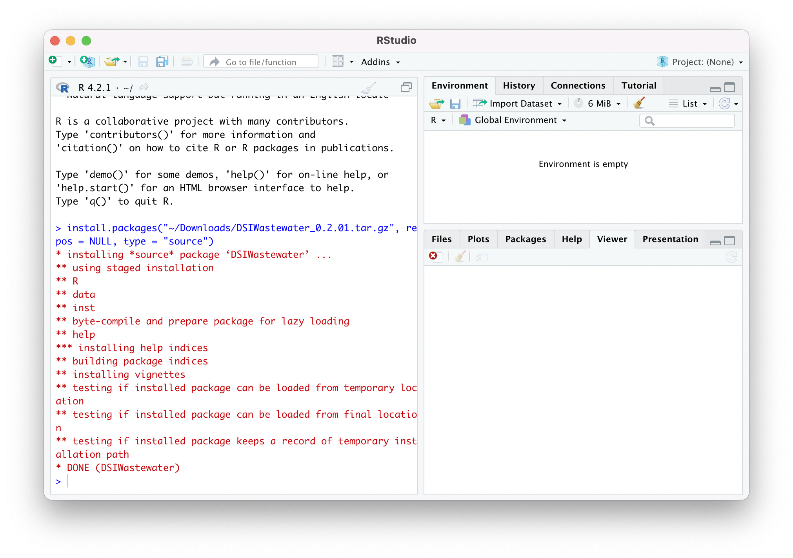

# The R Language

 We recommend the following two systems: 

### R Studio

R Studio is a complete integrated development environment for R:
https://www.rstudio.com 

  

    
  

### R Console

This is a simple console app which provides a command line interface to the R interpreter:
https://cran.r-project.org/bin 

  

    
  

